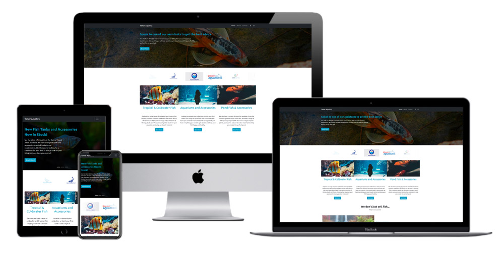
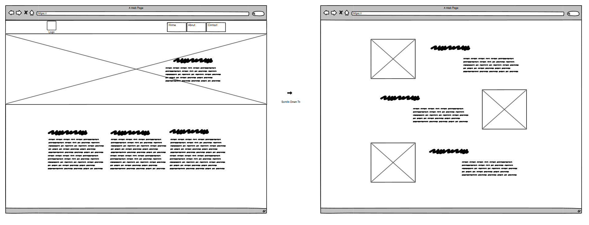
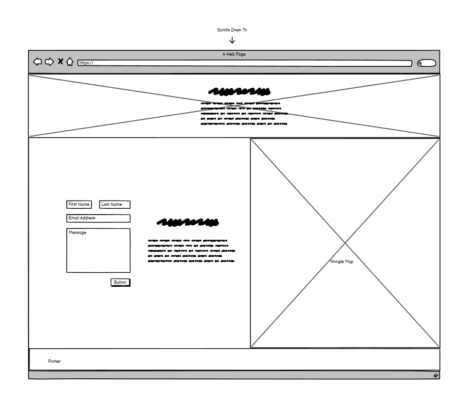
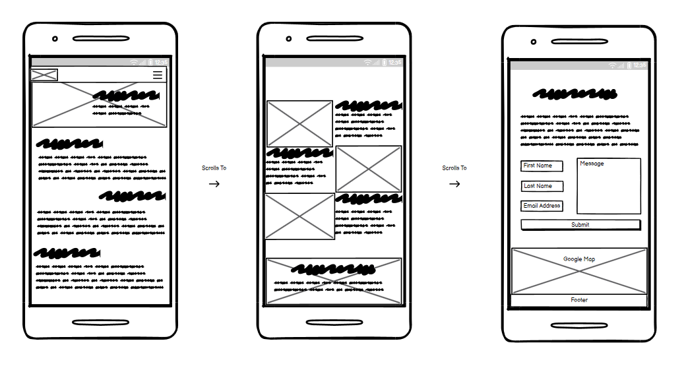

# Tamar Aquatics Website Refresh

View the live website [here](https://jaimiehemmings.github.io/HTML-CSS-Project/)

Tamar Aquatics is local aquarium store near me that I believe could use a website update in order to increase social media engagement and drive sales. Tamar Aquatics has a range of services beyond simply selling a variety of Coldwater and Tropical Fish.

**Table of Content:**

- [Overview](#Overview)
- [User Experience UX](#UX)
- [Features](#features)
- [Technologies Used](#TechnologiesUsed)
- [Testing](#Testing)
- [Deployment](#Deployment)
- [Credits](#Credits)
- [Acknowledgements](#Acknowledgements)

## Overview

As a stockist of live coldwater and tropical fish as well as a range of aquariums, decorations, substrates, food, aquarium plants and various other accessories, Tamar Aquatics needs a way to communicate their stock and services to the general public.

In addition to this, Tamar Aquatics also has several members on staff that are qualified experts in animal husbandry.

In order to address the questions and concerns of the general public, Tamar Aquatics website needs to:

- Establish the companies brand and visual identity
- Provide information on services available on site
- Provide bite sze and easy to digest information on animal care
- Offer a comprehensive overview of current availability of stock
- Establish the companies authority in animal care knowledge

## User Experience (UX)

### User Stories

#### First Time Visitor Goals

As a first time visitor...

- I want to be able to easily understand the purpose of the website.
- I want to easily understand the services available at the store.
- I want to be able to easily navigate the site to find what I am looking for.
- I want to be able to easily sign up for an account.
- I want to easily be able to sign up for their newsletter.
- I want to be able to find information on their current inventory.
- I want to be able to make purchases through the website for either collection or delivery.

#### Reurning Visitor Goals

As a returning visitor...

- I want to be able to see the latest additions to inventory.
- I want to be able to easily find information relevant to my query.
- I want to be able to easily find contact information for the store.

#### Frequent Visitor Goals

As a frequent visitor...

- I would like to find out about any upcoming events that may be happening in the store.
- I would like to modify my preferences for newsletters.
- I would like to know more about the store and the expertise of the staff.

#### Frequent Visitor (Client) Goals

- As a frequent visitor (client) I would like to be able to log in to my account.

### Design

- Colour Scheme

  The main colours used on the website are a deep blue, a lighter shade of blue, green, black and white. These colours allow me to create an aesthetic website while offering good contrast to improve readability of text as well as draw attention to important sections of the website. colour can have a massive impact on an individuals psychology and how they interprate a message. [The psychology of Color](https://99designs.com/blog/creative-inspiration/psychology-color-web-design/)

- Typography

  For fonts I will be using "Ubuntu". With Ubuntu Bold being used mostly for headings and interactive elements to help draw attention as well as being a sans serif font offering increased legibility on all screen types.

- Imagery

  Images used across the site were carefully selected for their low file size to improve load times while maintaining a high quality to improve fidelity on larger screens. Images will focus on fish and natural habitats of those fish as well as images of products sold in the store.

### Wireframes

- Homepage Wireframes

  
  

- Mobile Wireframes

  

## Features

- The Tamar Aquatics Website needs to be responsive on all screen sizes.
- The website uses rich media content and elements including Forms, links, and buttons.
- The website features a Homepage, About Us, and a Contact page. A login page for fictional customers which redirects to a thank you page upon submission.
- The website also features an interactive carousel at the top of the homepage.
- A form on the Contact page allows users to send a message to the owners of the website and offers the option to sign up for newsletters at the same time.
- The website is compatible with assistive technology such as screen readers.

## Technologies Used

### Languages Used

- HTML
- CSS

### Frameworks, Libraries and Programmes Used

1. [Josh's Custom CSS Reset](https://www.joshwcomeau.com/css/custom-css-reset/)
2. [Google Fonts Ubuntu](https://fonts.google.com/specimen/Ubuntu)
3. [CloudConvert](https://cloudconvert.com/)
   - For converting images to webp format.
4. [Bootstrap 5](https://getbootstrap.com/)
5. [Font Awesome](https://fontawesome.com/)
6. Photoshop
  - Photoshop was used to resize and optimise images in preparation for use on the Tamar Aquatics Website.
7. Git
  - Git was used for Version Control.
8. GitHub
  - GitHub is used as the repository for the project
9. Balsamiq
  - Balsamiq was used to create the wireframes for the homepage of the website.
10. Dev Tools were used to aid in the development and testing of the website across the following broswers:
  - Chrome
  - Safari
  - Edge
  - Firefox

## Testing

During the development stage I continuously carried out tests across a variety of devices each time a new feature, major change or group of small changes were implemented. This was to ensure that there were no issues with the code, accessibility, responsiveness or design. In order to carry out these tests I used the developer tools in each of the 4 major browsers; Chrome, Edge, Firefox and Safari.

### Bugs and Solutions

1. The use of the `view()` CSS function can be used with `animation-timeline`. However, it has limited availability across the major browsers. At the time of writing this document, it is only supported on Chrome and Edge. Regardless, the usage of this CSS function does not cause any issues when viewed in Firefox or Safari but does provide additional aesthetic enhancements for users on Chrome and Edge and so I have decide to commit to the usage of this CSS function. Additionally, in future, I imagine that Safari and Firefox will be updated to be compatible with the `view()` CSS function. [MDN Web Docs](https://developer.mozilla.org/en-US/docs/Web/CSS/animation-timeline/view)

2. Using the `background-attachment: fixed` is not supported on iOS devices and is a known long standing issue. While this is not important to the functionality of the page itself, I felt it was disappointing not to have the pseudo-parallax feature present on iOS mobile devices. Fortunately I found [this](https://webers-testseite.de/donkey/) that provides a work around by simply creating a pseudo class on the parent element and then using position fixed with the background image contained within that.

## Deployment

### GitHub Pages

- The project uses GitHub pages for Deployment using the following steps

1. Create and/or Log in to GitHub
2. Locate the repository within GitHub
3. Within the repository, click on Settings
4. Within the settings page locate the sub-menu on the left hand side and click on Pages
5. Under "Source" select "Branch:main" then /root
6. Click Save
7. Wait a few moments for the repository to deploy
8. At this point the repository will be deployed and ready to view

## Credits

### Content

- The Code Institute README template was used as the basis for the creation of this project's README file.

### Media

[Unsplash](https://unsplash.com/) Was used to source images used across the site.

[99designs](https://99designs.com/inspiration/logos/aquarium) for various fake logos.

## Acknowledgements

- Special thanks to Code Institute for a highly effective and engagement learning environment and to East Kent College for the support and insights offered into the assessment criteria.

## Copyright

- [Jaimie Warburton/Hemmings](https://github.com/JaimieHemmings) 2024
