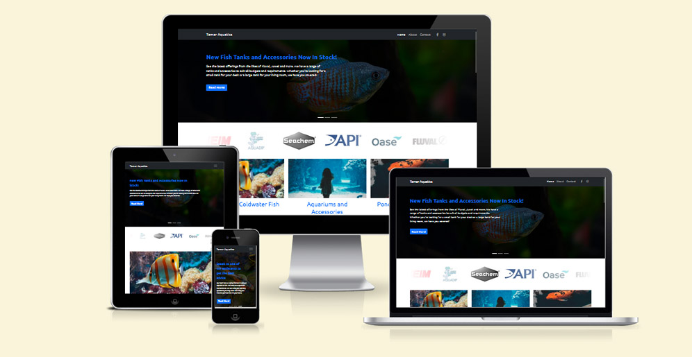
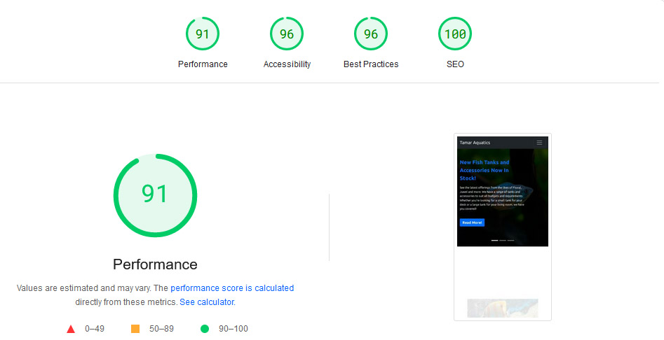

# Tamar Aquatics Website Refresh

View the live website [here](https://jaimiehemmings.github.io/HTML-CSS-Project/)

Tamar Aquatics is local aquarium store near me that I believe could use a website update in order to increase social media engagement and drive sales. Tamar Aquatics has a range of services beyond simply selling a variety of Coldwater and Tropical Fish.

# Table of Content:

- [Overview](#Overview)
- [User Experience UX](#UX)
- [Features](#features)
- [Technologies Used](#TechnologiesUsed)
- [Testing](#Testing)
- [Deployment](#Deployment)
- [Credits](#Credits)
- [Acknowledgements](#Acknowledgements)

## Overview

As a stockist of live coldwater and tropical fish as well as a range of aquariums, decorations, substrates, food, aquarium plants and various other accessories, Tamar Aquatics needs a way to communicate their stock and services to the general public.

In addition to this, Tamar Aquatics also has several members on staff that are qualified experts in animal husbandry.

In order to address the questions and concerns of the general public, Tamar Aquatics website needs to:

- Establish the companies brand and visual identity
- Provide information on services available on site
- Provide bite size and easy to digest information on animal care
- Establish the companies authority in animal care knowledge

## User Experience (UX)

### User Stories

#### First Time Visitor Goals

As a first time visitor...

- I want to be able to easily understand the purpose of the website.
- I want to easily understand the services available at the store.
- I want to be able to easily navigate the site to find what I am looking for.
- I want to easily find information on caring for fish.

#### Reurning Visitor Goals

As a returning visitor...

- I want to be able to easily find information relevant to my query.
- I want to be able to easily find contact information for the store.
- I want to easily find how to get to the store.
- I want to find information on fish care.

#### Frequent Visitor Goals

As a frequent visitor...

- I want to easily be able to sign up for their newsletter.
- I would like to find the social media pages for the store.
- I would like to know more about the store and the expertise of the staff.
- I would like to be able to directly contact the staff.

### Design

- Colour Scheme

  The main colours used on the website are a deep blue, a lighter shade of blue, black and white. These colours allow me to create an aesthetic website while offering good contrast to improve readability of text as well as draw attention to important sections of the website. colour can have a massive impact on an individuals psychology and how they interprate a message. [The psychology of Color](https://99designs.com/blog/creative-inspiration/psychology-color-web-design/)

- Typography

  For fonts I will be using "Ubuntu". With Ubuntu Bold being used mostly for headings and interactive elements to help draw attention as well as being a sans serif font offering increased legibility on all screen types.

- Imagery

  Images used across the site were carefully selected for their low file size to improve load times while maintaining a high quality to improve fidelity on larger screens. Images will focus on fish and natural habitats of those fish as well as images of products sold in the store.

### Wireframes

- Homepage Wireframes

  
  

- Mobile Wireframes

  

## Features

- The Tamar Aquatics Website needs to be responsive on all screen sizes.
- The website uses rich media content and elements including Forms, links, and buttons.
- The website features a Homepage, About Us, and a Contact page.
- The website also features an interactive carousel at the top of the homepage.
- A form on the Contact page allows users to send a message to the owners of the website and offers the option to sign up for newsletters at the same time.
- The website is compatible with assistive technology such as screen readers.

## Technologies Used

### Languages Used

- HTML
- CSS
- JavaScript
    * To highlight current day on business hours.

### Frameworks, Libraries and Programmes Used

1. [Josh's Custom CSS Reset](https://www.joshwcomeau.com/css/custom-css-reset/)
2. [MarketingTool Random Face Generator](https://www.marketingtool.online/en/face-generator/)
2. [Google Fonts Ubuntu](https://fonts.google.com/specimen/Ubuntu)
3. [CloudConvert](https://cloudconvert.com/)
   - For converting images to webp format.
4. [Bootstrap 5](https://getbootstrap.com/)
5. [Font Awesome](https://fontawesome.com/)
6. Photoshop
    - Photoshop was used to resize and optimise images in preparation for use on the Tamar Aquatics Website.
7. Git
    - Git was used for Version Control.
8. GitHub
    - GitHub is used as the repository for the project
9. Balsamiq
    - Balsamiq was used to create the wireframes for the homepage of the website.
10. Dev Tools were used to aid in the development and testing of the website across the following broswers:
    - Chrome
    - Safari
    - Edge
    - Firefox

## Testing

During the development stage I continuously carried out tests across a variety of devices each time a new feature, major change or group of small changes were implemented. This was to ensure that there were no issues with the code, accessibility, responsiveness or design. In order to carry out these tests I used the developer tools in each of the 4 major browsers; Chrome, Edge, Firefox and Safari.

### Bugs and Solutions

1. The use of the `view()` CSS function can be used with `animation-timeline`. However, it has limited availability across the major browsers. At the time of writing this document, it is only supported on Chrome and Edge. Regardless, the usage of this CSS function does not cause any issues when viewed in Firefox or Safari but does provide additional aesthetic enhancements for users on Chrome and Edge and so I have decide to commit to the usage of this CSS function. Additionally, in future, I imagine that Safari and Firefox will be updated to be compatible with the `view()` CSS function. [MDN Web Docs](https://developer.mozilla.org/en-US/docs/Web/CSS/animation-timeline/view)

2. Using the `background-attachment: fixed` is not supported on iOS devices and is a known long standing issue. While this is not important to the functionality of the page itself, I felt it was disappointing not to have the pseudo-parallax feature present on iOS mobile devices. Fortunately I found [this](https://webers-testseite.de/donkey/) that provides a work around by simply creating a pseudo class on the parent element and then using position fixed with the background image contained within that.

3. After speaking to my mentor, he highlighted the input areas on the form appeared small and cramped. Taking this feedback on board I have added appropriate padding to the input and textarea inputs on the form, making them appear more intentionally styled.

4. Testing my site with the Lighthouse testing tools highlighted an issue where adding aria labels for a background image directly to a div tag was against conventions. I have therefore placed the aria labels inside the div using an `sr-only` classed span.

5. W3C Validation also brought to my attention an issue with using defer on an inline script. I have therefore removed the attribute and placed the script at the bottom of the page just before the closing `body` tag.

6. In order to improve my Lighthouse score for performance I also optimised the size of a lot of the images used on the website and converted the jpg and png images to webp to further optimise them and reduce network traffic and contentful paint times.

7. In Josh's CSS Reset, a vendor prefix was used: `-webkit-font-smoothing`. [MDN Documentation](https://developer.mozilla.org/en-US/docs/Web/CSS/font-smooth) recommend not using this feature as it is non-standard. It also is returned as non-compliant by the W3C CSS Validator. I have therefore removed it from my CSS.

### Remaining Bugs

No other bugs have been found.

### Validation Results

In order to ensure my code was W3C compliant and reduce the possibility of any bugs or broken code I used W3C Markup validation, W3C CSS Validation and Lighthouse Testing Reports on all pages across the website. The Lighthouse Testing Reports also test for Performance, Accessibility, Best Practices and SEO.

#### Lighthouse Test Results

- Index page on Mobile

- Index page on Desktop

- About page on Mobile

- About page on Desktop

- Contact page on Mobile

- Contact page on Desktop

#### a11y Contrast Test

- Homepage Contrast Test Result

- About Page Contrast Test Result

- Contact Page Contrast Test Result

#### W3C HTML Test Results

[Homepage Results](https://validator.w3.org/nu/?doc=https%3A%2F%2Fjaimiehemmings.github.io%2FHTML-CSS-Project%2F)

[About Page Results](https://validator.w3.org/nu/?doc=https%3A%2F%2Fjaimiehemmings.github.io%2FHTML-CSS-Project%2Fabout.html)

[Contact Page Results](https://validator.w3.org/nu/?doc=https%3A%2F%2Fjaimiehemmings.github.io%2FHTML-CSS-Project%2Fcontact.html)

As you can see from the above results, my HTML has no errors and one warning. The warning is due to a comment above an image where I give credit to the source of the image used. For this reason I have ignored this warning.

#### W3C CSS Test Results

Results can be viewed [here](https://jigsaw.w3.org/css-validator/validator?uri=https%3A%2F%2Fjaimiehemmings.github.io%2FHTML-CSS-Project%2F&profile=css3svg&usermedium=all&warning=1&vextwarning=&lang=en)

For the purposes of this project I am ignoring errors resulting from external CSS packages, (Bootstrap for example). In my own CSS I have one error relating to the previously mentioned issue of using the `animation-timeline` property which is not yet implemented broadly across all browsers.

I have made the decision to ignore this error as the inclusion of this property does not cause any issues in terms of readability or accessibility but does provide a slightly richer experience for users on the Chrome and Edge broswers.

### Testing User Stories

- First Time Visitor Goals

  - I want to be able to easily understand the purpose of the website.

    * Upon completion of the initial site load, users should arrive at the homepage. The initial feature presented to the user is a scrolling carousel displaying the various products and services available from the store.
    

    * Below the carousel is marquee of associated brands immediately followed another section displaying a summary of offerings from the store, further elaborating the purpose of the website.
    

    * Again, below this section is another section explaining services offered beyond the sale of fish, aquariums and accessories. The user is also able to acquire help, support and advice on all manner of fish care related issues and queries.
    

  - I want to easily understand the services available at the store.

  - I want to be able to easily navigate the site to find what I am looking for.

    * The website features a sticky navigation bar with clear links to various sections of the website ensuring that the user is able to easily navigate to other parts of the website regardless of what part of the website they are currently on.
    

  - I want to easily find information on caring for fish.

    * The homepage features a nearly full screen call to action reassuring the suer that the staff at the store are all very knowledgeable in terms of fish care and encourages them to get in touch using the contact form.
    
    
    * An FAQ section on the contact page provides the user with a number of solutions to common queries.
    

    * Beyond the FAQ the user is also encouraged to contact the store directly using the contact form for any other queries.
    

    * I would have also liked to include specific fish care instructions and general aquarium set up guidance but that would have been beyond the scope of this project.

- Returning Visitor Goals

- Frequent Visitor Goals

### Future Development

  - An up to date display of current inventory
  - Blogging functionality to allow the staff to post updates and case studies
  - Account functionality allowing users to log in and make orders for either click &amp; collect or delivery and pay online
  - Fish care guides for individual species
  - Aquarium set up guides

## Deployment

### GitHub Pages

- The project uses GitHub pages for Deployment using the following steps

1. Create and/or Log in to GitHub
2. Locate the repository within GitHub
3. Within the repository, click on Settings
4. Within the settings page locate the sub-menu on the left hand side and click on Pages
5. Under "Source" select "Branch:main" then /root
6. Click Save
7. Wait a few moments for the repository to deploy
8. At this point the repository will be deployed and ready to view

## Credits

### Code

- Special thanks to Josh for his [CSS Reset](https://www.joshwcomeau.com/css/custom-css-reset/)

### Content

- All content for the project was written by the developer.
- The Code Institute README template was used as the basis for the creation of this project's README file.

### Media

- [Unsplash](https://unsplash.com/) Was used to source images used across the site.
- [99designs](https://99designs.com/inspiration/logos/aquarium) for various fake logos.

## Acknowledgements

- Special thanks to Code Institute for a highly effective and engagement learning environment and to East Kent College for the support and insights offered into the assessment criteria.
- Additional thanks to my Mentor, Brian Macharia, for taking the time to provide me with feedback and guidance.

## Copyright

- [Jaimie Warburton/Hemmings](https://github.com/JaimieHemmings) 2024
